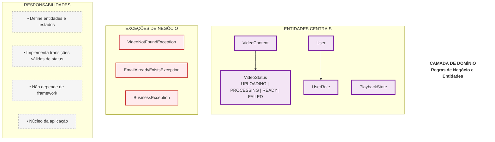
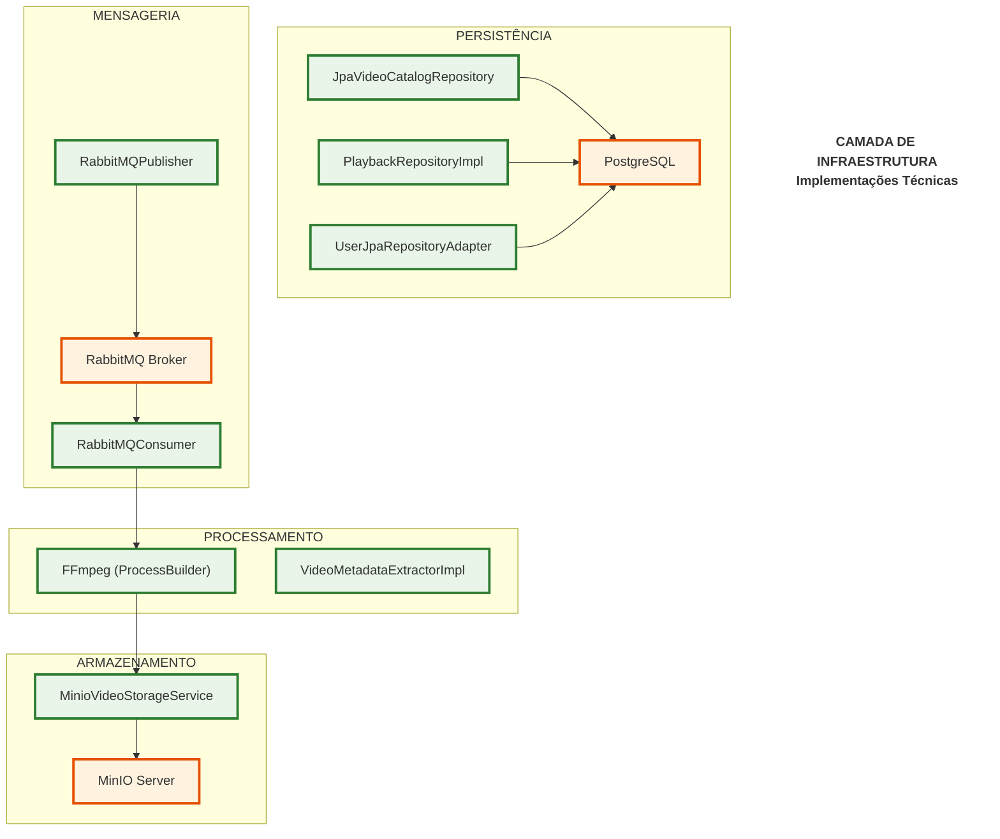
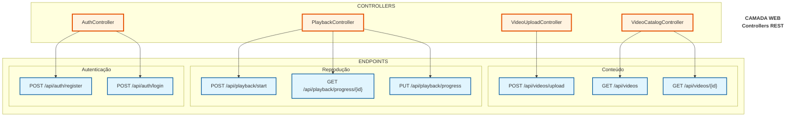
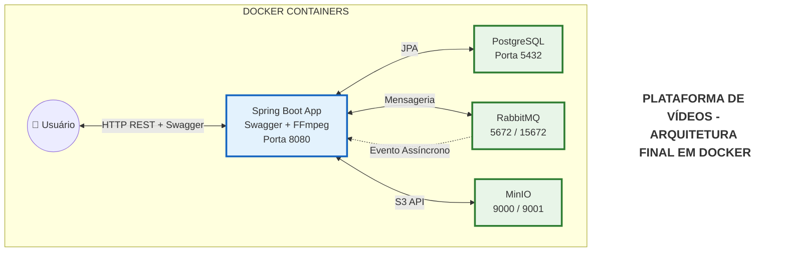

# MiniStreaming

MiniStreaming é uma aplicação backend desenvolvida em **Java + Spring
Boot**, projetada com **Clean Architecture + DDD + Event-Driven
Architecture**, simulando a base estrutural de uma plataforma de
streaming moderna.

### DIAGRAMA 1: CAMADA DE DOMÍNIO 

### DIAGRAMA 2: CAMADA DE APLICAÇÃO (Casos de Uso)

```mermaid
graph TB
    title["CAMADA DE APLICAÇÃO<br/>Casos de Uso e Ports"]
    style title fill:#fff,stroke:none,font-family:Arial,font-size:16px,font-weight:bold

    subgraph UseCases["CASOS DE USO"]
        direction TB
        
        UC1["UploadVideoUseCase"]
        UC2["ListVideosUseCase"]
        UC3["ProcessVideoUseCase"]
        
        UP1["StartPlaybackUseCase"]
        UP2["GetPlaybackProgressUseCase"]
        UP3["SavePlaybackProgressUseCase"]
        
        UU1["RegisterUserUseCase"]
        UU2["AuthenticateUserUseCase"]
    end

    subgraph Ports["PORTS (INTERFACES)"]
        direction TB
        P1["VideoCatalogRepository"]
        P2["VideoStorageService"]
        P3["VideoMetadataExtractor"]
        P4["VideoProcessingPublisher"]
        P5["PlaybackRepository"]
        P6["UserRepository"]
    end

    UC1 --> P1 & P2 & P4
    UC2 --> P1
    UC3 --> P1 & P3
    
    UP1 --> P5
    UP2 --> P5
    UP3 --> P5
    
    UU1 --> P6
    UU2 --> P6

    classDef usecase fill:#e3f2fd,stroke:#1565c0,stroke-width:3px
    classDef ports fill:#fff3e0,stroke:#ff6f00,stroke-width:2px,stroke-dasharray: 5 5
    
    class UC1,UC2,UC3,UP1,UP2,UP3,UU1,UU2 usecase
    class P1,P2,P3,P4,P5,P6 ports


```

### DIAGRAMA 3: CAMADA DE INFRAESTRUTURA (Implementações)

### DIAGRAMA 4: CAMADA WEB (Interface com Usuário)

### DIAGRAMA 5: VISÃO GERAL DO FLUXO (Resumo)

------------------------------------------------------------------------

# Funcionalidades

-   Upload de vídeos
-   Processamento assíncrono com RabbitMQ
-   Extração de metadata (ex: duração, resolução)
-   Geração de HLS
-   Catálogo com controle de status
-   Autenticação com JWT
-   Persistência com JPA
-   Armazenamento de objetos com MinIO (S3 compatible)

------------------------------------------------------------------------

# Arquitetura

O projeto segue separação clara de responsabilidades:

    Domain
    Application (Use Cases + Ports)
    Infrastructure (Adapters)
    Web (Controllers)

## Princípios aplicados

-   Clean Architecture
-   Domain-Driven Design (DDD)
-   Ports and Adapters
-   Event-Driven Architecture
-   Separação entre regra de negócio e infraestrutura

------------------------------------------------------------------------

# Ciclo de Vida do Vídeo

Fluxo de estados:

    UPLOADING → PROCESSING → READY
                          ↘ FAILED

### Estados:

-   **UPLOADING** → vídeo recebido e armazenado
-   **PROCESSING** → evento publicado no RabbitMQ
-   **READY** → metadata extraída + HLS gerado
-   **FAILED** → erro no pipeline

O `VideoStatus` é a única fonte de verdade do estado do vídeo.

------------------------------------------------------------------------

# Fluxo Assíncrono

1.  Upload do vídeo via endpoint
2.  Armazenamento no MinIO
3.  Publicação de evento no RabbitMQ
4.  Consumer processa o vídeo
5.  Atualização de status no banco

------------------------------------------------------------------------

# Segurança

-   Autenticação via JWT
-   Senhas criptografadas com BCrypt
-   Controle de acesso baseado em roles

------------------------------------------------------------------------

# Playback

-   Início de reprodução
-   Salvamento de progresso
-   Recuperação de estado

------------------------------------------------------------------------

# Stack Tecnológica

-   Java 17+
-   Spring Boot
-   Spring Data JPA
-   RabbitMQ   
-   MinIO
-   JWT
-   FFmpeg
-   Docker

------------------------------------------------------------------------

#  Executando com Docker (exemplo)

``` bash
docker-compose up -d
```

Serviços esperados:

-   PostgreSQL
-   RabbitMQ
-   MinIO
-   App( Java + ffmpeg)


------------------------------------------------------------------------

#  Objetivo do Projeto

Este projeto foi desenvolvido como laboratório arquitetural para:

-   Explorar arquitetura limpa na prática
-   Modelar agregados corretamente
-   Trabalhar com processamento assíncrono
-   Simular padrões usados por plataformas reais de streaming
-   Evoluir para possível arquitetura de microsserviços

------------------------------------------------------------------------

#  Autor

Desenvolvido por Luis Nunes.
