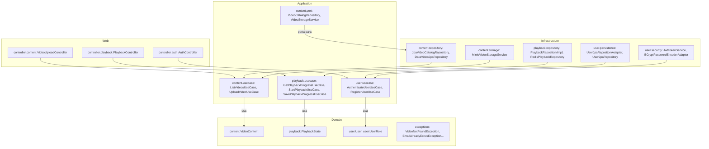

# Video-Streaming-Platform (MinIO + Spring + Redis + Events)

Plataforma de streaming de vídeos com controle de progresso de playback, URLs temporárias via Object Storage (MinIO/S3), cache de estado em Redis, persistência histórica e arquitetura orientada a eventos.

Structure:
## 1. High-Level Architecture

