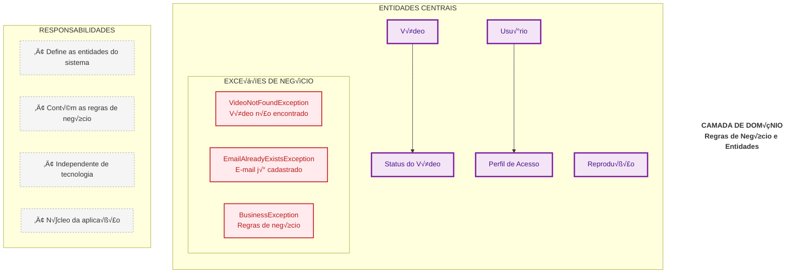
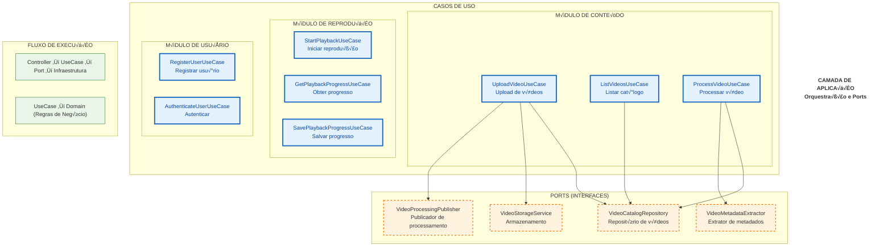
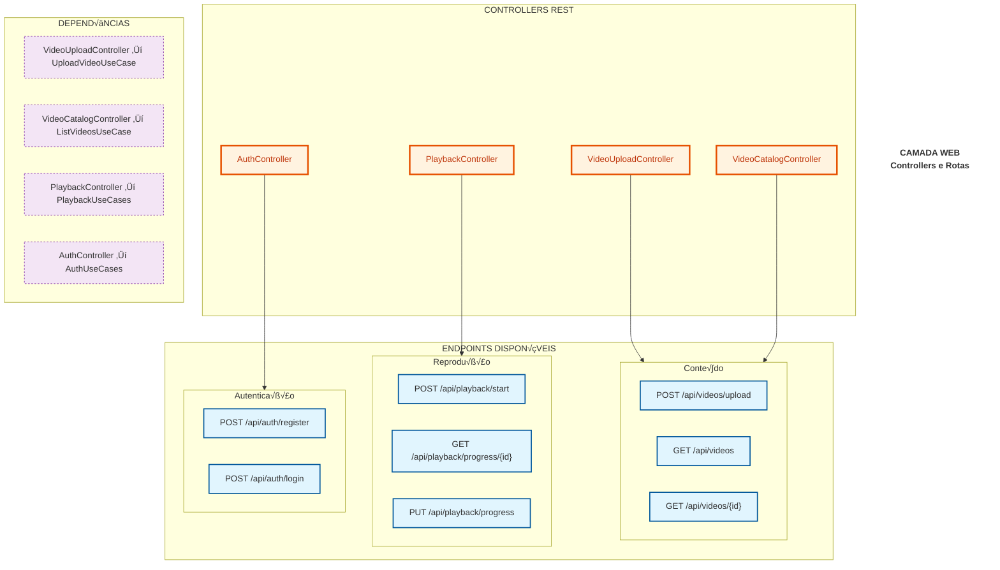
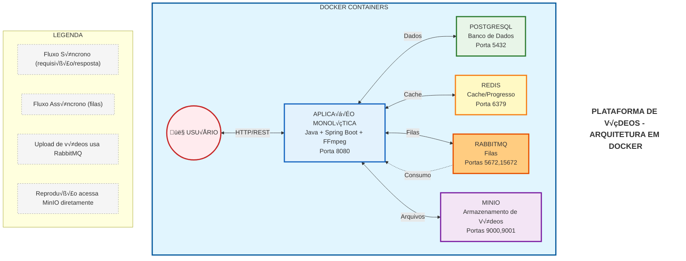

# MiniStreaming

MiniStreaming é uma aplicação backend desenvolvida em **Java + Spring
Boot**, projetada com **Clean Architecture + DDD + Event-Driven
Architecture**, simulando a base estrutural de uma plataforma de
streaming moderna.

### DIAGRAMA 1: CAMADA DE DOMÍNIO 

``` mermaid
graph TB
    title["CAMADA DE DOMÍNIO<br/>Regras de Negócio e Entidades"]
    style title fill:#fff,stroke:none,font-family:Arial,font-size:16px,font-weight:bold

    subgraph Dominio["ENTIDADES CENTRAIS"]
        direction TB
        
        Video["Vídeo"]
        Status["Status do Vídeo"]
        Playback["Reprodução"]
        Usuario[" Usu√°rio"]
        Perfil["Perfil de Acesso"]
        
        Video --> Status
        Usuario --> Perfil
        
        subgraph Excecoes["EXCEÇÕES DE NEGÓCIO"]
            Ex1["VideoNotFoundException<br/>Vídeo não encontrado"]
            Ex2["EmailAlreadyExistsException<br/>E-mail j√° cadastrado"]
            Ex3["BusinessException<br/>Regras de negócio"]
        end
    end

    subgraph Responsabilidades["RESPONSABILIDADES"]
        R1["• Define as entidades do sistema"]
        R2["• Contém as regras de negócio"]
        R3["• Independente de tecnologia"]
        R4["• Núcleo da aplicação"]
    end

    classDef titulo fill:#fff,stroke:none,font-family:Arial
    classDef entidades fill:#f3e5f5,stroke:#7b1fa2,stroke-width:3px,color:#4a148c
    classDef excecoes fill:#ffebee,stroke:#c62828,stroke-width:2px,color:#b71c1c
    classDef responsabilidades fill:#f5f5f5,stroke:#9e9e9e,stroke-width:1px,stroke-dasharray: 3 3
    
    class Video,Status,Playback,Usuario,Perfil entidades
    class Ex1,Ex2,Ex3 excecoes
    class R1,R2,R3,R4 responsabilidades
```
### DIAGRAMA 2: CAMADA DE APLICAÇÃO (Casos de Uso)

```mermaid
graph TB
    title["CAMADA DE APLICAÇÃO<br/>Orquestração e Ports"]
    style title fill:#fff,stroke:none,font-family:Arial,font-size:16px,font-weight:bold

    subgraph Aplicacao["CASOS DE USO"]
        direction TB
        
        subgraph Content["MÓDULO DE CONTEÚDO"]
            AC1["UploadVideoUseCase<br/>Upload de vídeos"]
            AC2["ListVideosUseCase<br/>Listar cat√°logo"]
            AC3["ProcessVideoUseCase<br/>Processar vídeo"]
        end
        
        subgraph Playback["MÓDULO DE REPRODUÇÃO"]
            AP1["StartPlaybackUseCase<br/>Iniciar reprodução"]
            AP2["GetPlaybackProgressUseCase<br/>Obter progresso"]
            AP3["SavePlaybackProgressUseCase<br/>Salvar progresso"]
        end
        
        subgraph User["MÓDULO DE USUÁRIO"]
            AU1["RegisterUserUseCase<br/>Registrar usu√°rio"]
            AU2["AuthenticateUserUseCase<br/>Autenticar"]
        end
    end

    subgraph Ports["PORTS (INTERFACES)"]
        direction TB
        P1["VideoCatalogRepository<br/>Repositório de vídeos"]
        P2["VideoStorageService<br/>Armazenamento"]
        P3["VideoMetadataExtractor<br/>Extrator de metadados"]
        P4["VideoProcessingPublisher<br/>Publicador de processamento"]
    end

    subgraph Fluxo["FLUXO DE EXECUÇÃO"]
        F1["Controller ‚Üí UseCase ‚Üí Port ‚Üí Infraestrutura"]
        F2["UseCase → Domain (Regras de Negócio)"]
    end

    AC1 --> P1 & P2 & P4
    AC2 --> P1
    AC3 --> P1 & P3
    
    classDef titulo fill:#fff,stroke:none
    classDef usecase fill:#e3f2fd,stroke:#1565c0,stroke-width:3px,color:#0d47a1
    classDef ports fill:#fff3e0,stroke:#ff6f00,stroke-width:2px,stroke-dasharray: 5 5
    classDef fluxo fill:#e8f5e8,stroke:#2e7d32,stroke-width:1px
    
    class AC1,AC2,AC3,AP1,AP2,AP3,AU1,AU2 usecase
    class P1,P2,P3,P4 ports
    class F1,F2 fluxo

```
### DIAGRAMA 3: CAMADA DE INFRAESTRUTURA (Implementações)

```mermaid
graph TB
    title["CAMADA WEB<br/>Controllers e Rotas"]
    style title fill:#fff,stroke:none,font-family:Arial,font-size:16px,font-weight:bold

    subgraph Web["CONTROLLERS REST"]
        direction TB
        
        C1["VideoUploadController"]
        C2["VideoCatalogController"]
        C3["PlaybackController"]
        C4["AuthController"]
    end

    subgraph Endpoints["ENDPOINTS DISPONÍVEIS"]
        direction TB
        
        subgraph Content["Conte√∫do"]
            E1["POST /api/videos/upload"]
            E2["GET /api/videos"]
            E3["GET /api/videos/{id}"]
        end
        
        subgraph Playback["Reprodução"]
            E4["POST /api/playback/start"]
            E5["GET /api/playback/progress/{id}"]
            E6["PUT /api/playback/progress"]
        end
        
        subgraph Auth["Autenticação"]
            E7["POST /api/auth/register"]
            E8["POST /api/auth/login"]
        end
    end

    subgraph Dependencias["DEPENDÊNCIAS"]
        D1["VideoUploadController ‚Üí UploadVideoUseCase"]
        D2["VideoCatalogController ‚Üí ListVideosUseCase"]
        D3["PlaybackController ‚Üí PlaybackUseCases"]
        D4["AuthController ‚Üí AuthUseCases"]
    end

    C1 --> Content
    C2 --> Content
    C3 --> Playback
    C4 --> Auth
    
    classDef web fill:#fff3e0,stroke:#e65100,stroke-width:3px,color:#bf360c
    classDef endpoints fill:#e1f5fe,stroke:#01579b,stroke-width:2px
    classDef deps fill:#f3e5f5,stroke:#7b1fa2,stroke-width:1px,stroke-dasharray: 3 3
    
    class C1,C2,C3,C4 web
    class E1,E2,E3,E4,E5,E6,E7,E8 endpoints
    class D1,D2,D3,D4 deps
``` 
### DIAGRAMA 4: CAMADA WEB (Interface com Usu√°rio)

```mermaid
graph TB
    title["CAMADA WEB<br/>Controllers e Rotas"]
    style title fill:#fff,stroke:none,font-family:Arial,font-size:16px,font-weight:bold

    subgraph Web["CONTROLLERS REST"]
        direction TB
        
        C1["VideoUploadController"]
        C2["VideoCatalogController"]
        C3["PlaybackController"]
        C4["AuthController"]
    end

    subgraph Endpoints["ENDPOINTS DISPONÍVEIS"]
        direction TB
        
        subgraph Content["Conte√∫do"]
            E1["POST /api/videos/upload"]
            E2["GET /api/videos"]
            E3["GET /api/videos/{id}"]
        end
        
        subgraph Playback["Reprodução"]
            E4["POST /api/playback/start"]
            E5["GET /api/playback/progress/{id}"]
            E6["PUT /api/playback/progress"]
        end
        
        subgraph Auth["Autenticação"]
            E7["POST /api/auth/register"]
            E8["POST /api/auth/login"]
        end
    end

    subgraph Dependencias["DEPENDÊNCIAS"]
        D1["VideoUploadController ‚Üí UploadVideoUseCase"]
        D2["VideoCatalogController ‚Üí ListVideosUseCase"]
        D3["PlaybackController ‚Üí PlaybackUseCases"]
        D4["AuthController ‚Üí AuthUseCases"]
    end

    C1 --> Content
    C2 --> Content
    C3 --> Playback
    C4 --> Auth
    
    classDef web fill:#fff3e0,stroke:#e65100,stroke-width:3px,color:#bf360c
    classDef endpoints fill:#e1f5fe,stroke:#01579b,stroke-width:2px
    classDef deps fill:#f3e5f5,stroke:#7b1fa2,stroke-width:1px,stroke-dasharray: 3 3
    
    class C1,C2,C3,C4 web
    class E1,E2,E3,E4,E5,E6,E7,E8 endpoints
    class D1,D2,D3,D4 deps
```
### DIAGRAMA 5: VISÃO GERAL DO FLUXO (Resumo)

```mermaid
graph TB
    title["PLATAFORMA DE VÍDEOS - ARQUITETURA EM DOCKER"]
    style title fill:#fff,stroke:none,font-family:Arial,font-size:20px,font-weight:bold

    User(("👤 USUÁRIO"))
    
    subgraph Docker["DOCKER CONTAINERS"]
        
        App["APLICAÇÃO MONOLÍTICA<br/>Java + Spring Boot + FFmpeg<br/>Porta 8080"]
        
        DB["POSTGRESQL<br/>Banco de Dados<br/>Porta 5432"]
        
        Cache["REDIS<br/>Cache/Progresso<br/>Porta 6379"]
        
        Queue["RABBITMQ<br/>Filas<br/>Portas 5672,15672"]
        
        Storage["MINIO<br/>Armazenamento de Vídeos<br/>Portas 9000,9001"]
        
        %% Conexões principais
        User <-->|HTTP/REST| App
        App <-->|Dados| DB
        App <-->|Cache| Cache
        App <-->|Filas| Queue
        App <-->|Arquivos| Storage
        
        %% Conexões internas
        Queue -.->|Consumo| App
    end
    
    %% Legendas
    subgraph Legenda["LEGENDA"]
        L1[" Fluxo Síncrono (requisição/resposta)"]
        L2["Fluxo Assíncrono (filas)"]
        L3["Upload de vídeos usa RabbitMQ"]
        L4["Reprodução acessa MinIO diretamente"]
    end
    
    classDef user fill:#ffebee,stroke:#c62828,stroke-width:3px
    classDef docker fill:#e1f5fe,stroke:#01579b,stroke-width:3px
    classDef app fill:#e3f2fd,stroke:#1565c0,stroke-width:3px
    classDef db fill:#e8f5e8,stroke:#2e7d32,stroke-width:3px
    classDef cache fill:#fff9c4,stroke:#f57f17,stroke-width:3px
    classDef queue fill:#ffcc80,stroke:#e65100,stroke-width:3px
    classDef storage fill:#f3e5f5,stroke:#7b1fa2,stroke-width:3px
    classDef legenda fill:#f5f5f5,stroke:#9e9e9e,stroke-width:1px,stroke-dasharray: 3 3
    
    class User user
    class Docker docker
    class App app
    class DB db
    class Cache cache
    class Queue queue
    class Storage storage
    class L1,L2,L3,L4 legenda
```
------------------------------------------------------------------------

# Funcionalidades

-   Upload de vídeos
-   Processamento assíncrono com RabbitMQ
-   Extração de metadata (ex: duração, resolução)
-   Geração de HLS
-   Cat√°logo com controle de status
-   Autenticação com JWT
-   Persistência com JPA
-   Cache de playback com Redis
-   Armazenamento de objetos com MinIO (S3 compatible)

------------------------------------------------------------------------

# Arquitetura

O projeto segue separação clara de responsabilidades:

    Domain
    Application (Use Cases + Ports)
    Infrastructure (Adapters)
    Web (Controllers)

## Princípios aplicados

-   Clean Architecture
-   Domain-Driven Design (DDD)
-   Ports and Adapters
-   Event-Driven Architecture
-   Separação entre regra de negócio e infraestrutura

------------------------------------------------------------------------

# Ciclo de Vida do Vídeo

Fluxo de estados:

    UPLOADING ‚Üí PROCESSING ‚Üí READY
                          ‚Üò FAILED

### Estados:

-   **UPLOADING** → vídeo recebido e armazenado
-   **PROCESSING** ‚Üí evento publicado no RabbitMQ
-   **READY** → metadata extraída + HLS gerado
-   **FAILED** ‚Üí erro no pipeline

O `VideoStatus` é a única fonte de verdade do estado do vídeo.

------------------------------------------------------------------------

# Fluxo Assíncrono

1.  Upload do vídeo via endpoint
2.  Armazenamento no MinIO
3.  Publicação de evento no RabbitMQ
4.  Consumer processa o vídeo
5.  Atualização de status no banco

------------------------------------------------------------------------

# Segurança

-   Autenticação via JWT
-   Senhas criptografadas com BCrypt
-   Controle de acesso baseado em roles

------------------------------------------------------------------------

# Playback

-   Início de reprodução
-   Salvamento de progresso
-   Recuperação de estado
-   Persistência em Redis

------------------------------------------------------------------------

# Stack Tecnológica

-   Java 17+
-   Spring Boot
-   Spring Data JPA
-   RabbitMQ
-   Redis
-   MinIO
-   JWT
-   FFmpeg
-   Docker

------------------------------------------------------------------------

#  Executando com Docker (exemplo)

``` bash
docker-compose up -d
```

Serviços esperados:

-   PostgreSQL
-   RabbitMQ
-   Redis
-   MinIO
-   App( Java + ffmpeg)


------------------------------------------------------------------------

#  Objetivo do Projeto

Este projeto foi desenvolvido como laboratório arquitetural para:

-   Explorar arquitetura limpa na pr√°tica
-   Modelar agregados corretamente
-   Trabalhar com processamento assíncrono
-   Simular padrões usados por plataformas reais de streaming
-   Evoluir para possível arquitetura de microsserviços

------------------------------------------------------------------------

#  Autor

Desenvolvido por Luis Nunes.
